# Music Tagging with CNN Architectures
Deep Learning for Multi-Label Music Classification

Team Members:

Alexander Philipp Seibel (alps@itu.dk)

Tobias Morris Fuchs (tobf@itu.dk)

## 1. Central Problem, Domain & Data

Central Problem
This project addresses multi-label music genre classification, where each track may be 
associated with several genres and the label distribution is highly imbalanced. The goal 
is to build a model that can reliably assign the most relevant genre labels to each track.

Domain:
- Music Information Retrieval (MIR)
- Multi-label classification
- Genre prediction

Data:
- Dataset: Free Music Archive (FMA; https://freemusicarchive.org/)
- Size: ~107,000 audio tracks (MP3 format)
- Clip length: 30 seconds per track
- Labels: 106 genre-related classes (top genres, subgenres, sub-subgenres, etc.)
- Top-level genres: 16 (most of them music)
- Multi-label dataset (each track can have multiple genre labels)
- Strongly imbalanced label distribution (imbalance ratio of ~50)
- for more details see: fma_metadata_EDA.ipynb

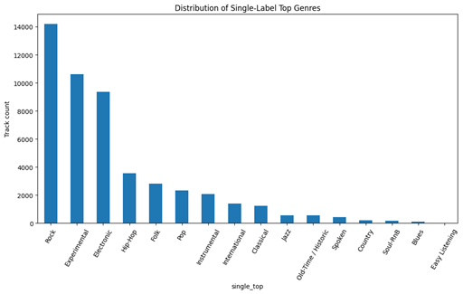

## 2. Preprocessing, Transformations & further EDA

  
Preprocessing & Transofrmations

### Prprocessing: 

Before generating spectrograms, we performed preprocessing (based on our EDA) on the FMA metadata to create a clean and usable dataset:

- Remove tracks without valid genre information: 
    Many entries in the raw metadata contain missing or empty genre lists, which cannot be used for supervised learning. These tracks were excluded.

- Exclude non-musical genre categories
    Some top-level categories (e.g., Experimental, including drones or machinery noise) contain non-musical content that differs fundamentally from typical music recordings.
    These categories were removed to avoid confusing the model.

- Select a curated set of top-level musical genres
    The FMA genre hierarchy is deep and highly fragmented.
    To keep the label space interpretable, we restricted the dataset to 12 musically meaningful top-level genres identified during EDA.

- Convert genres into multi-label format
    Many tracks naturally belong to multiple genres (e.g., Rock + Pop, Folk + Country), making the dataset inherently multi-label.
    We represent each track using binary indicators for all selected genres.

After all filtering and label processing, we created a final dataset containing 90086 audiofiles with clean metadata.

### Transformations: 

Before training the main models, we explored different ways of representing the audio data and we compared several common audio representations using a simple CNN baseline:

- **Waveform:** raw audio samples at 44.1 kHz, preserving full temporal detail but very high dimensional
- **Mel spectrogram:** time–frequency representation using 128 Mel bins, compact and perceptually motivated
- **CQT spectrogram:** frequency representation with logarithmic spacing, offering higher resolution at lower frequencies
- **Mel + CQT (combined):** two-channel input stacking both spectrogram types

Although this comparison was only exploratory, the Mel spectrogram showed the best 
performance in that small setup. For more information, read: https://github.itu.dk/alps/nlp-mini-project/blob/main/notebooks/readme_audiopreprocessing_and_representation_comparison.txt

We therefore convert each 30-second audio track into a log-Mel spectrogram. 
This representation maps the audio into a 2D time–frequency space that is well suited 
for convolutional neural networks:

- The audio is loaded and resampled to 32 kHz (original FMA files are 44.1 kHz). 
  This slightly reduces the maximum frequency from 22 kHz to 16 kHz and removes 
  only very high-frequency content (mainly overtones and cymbal shimmer) that is 
  not important for genre classification.

- A Short-Time Fourier Transform (STFT) is computed using a 25 ms window 
  (800 samples) and a 10 ms hop (320 samples). This produces a sequence of 
  overlapping time–frequency frames and captures how the spectral content 
  evolves over time.

- The resulting linear-frequency STFT magnitudes are mapped onto 128 Mel bins 
  using a Mel filterbank. This allocates finer resolution to lower frequencies 
  and broader filters to higher frequencies, reflecting human pitch perception 
  and reducing dimensionality (∼401 → 128 bins).

- The Mel magnitudes are converted to the logarithmic (dB) scale, which compresses 
  the dynamic range, emphasizes quieter but musically relevant components, and 
  provides a more stable input for neural networks.

- Each spectrogram is saved as a 128 × T matrix (T = 3000 time frames), forming 
  the final input representation for all CNN models.

  
EDA

### EDA

#### Some random examples of Mel-Spectrograms:

  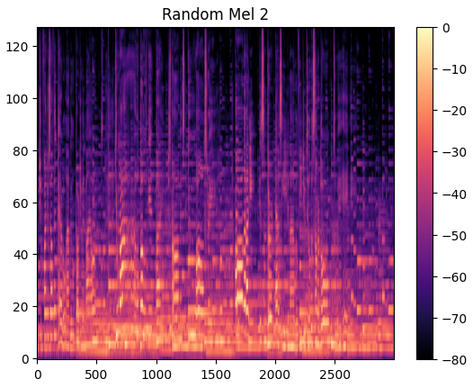 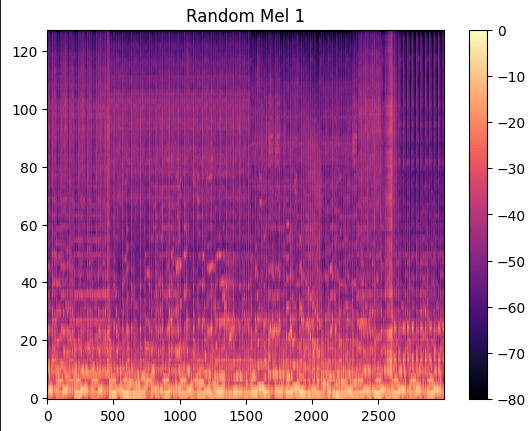 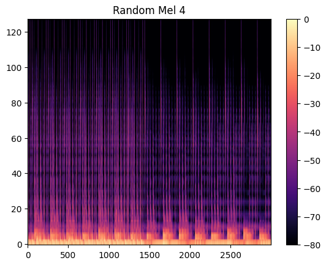 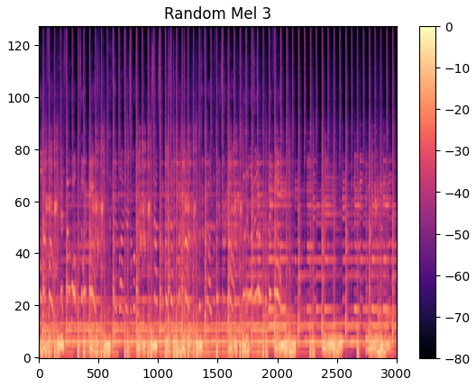

#### Value Range (min / max / mean):

- Minimum values are around –80 dB, representing silence or very quiet harmonics

- Maximum values are 0 dB, due to normalization with power_to_db

- Mean values typically fall between –50 and –40 dB, reflecting normal musical energy levels

--> ranges are standard for Mel-dB spectrograms and indicate correct preprocessing

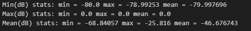

#### Mean Energy Distribution Across Tracks:

The mean Mel-dB energy per track forms a Gaussian-like distribution centered near –50 to –45 dB

No outliers or bimodal patterns appear

--> indicates consistent loudness across tracks and no preprocessing artifacts

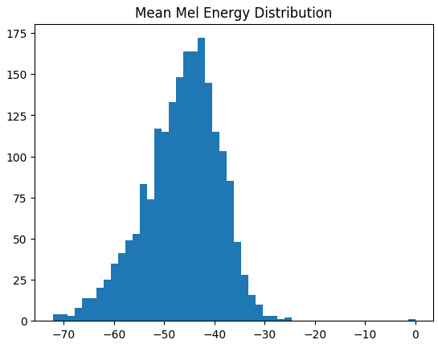

#### Mean Mel-Frequency Profiles per Genre:

Each curve shows the average energy across Mel bins for one genre (weighted for multi-label tracks).

Findings:

- All genres follow a similar global pattern (higher energy in low frequencies, decaying toward high frequencies).

- Differences between genres are subtle but systematic.

--> Confirms Mel spectrograms encode stable, interpretable frequency information.

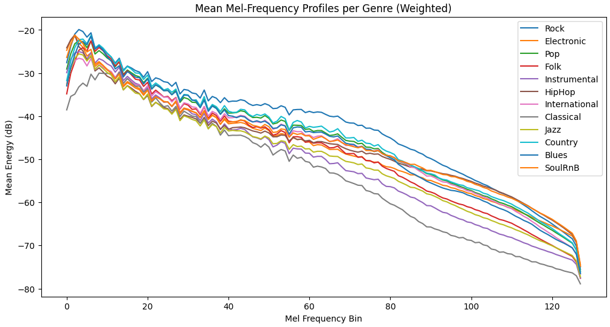

#### PCA of Genre Mean Profiles

We applied PCA (2D) to visualize relative differences between genres.

Findings:

- Classical is most separated from the others

- Rock / Blues / Country cluster closely.

- Electronic / SoulRnB cluster together.

- HipHop is separated from more acoustic genres.

Although differences in the raw curves were subtle, PCA reveals stable structure across genres.

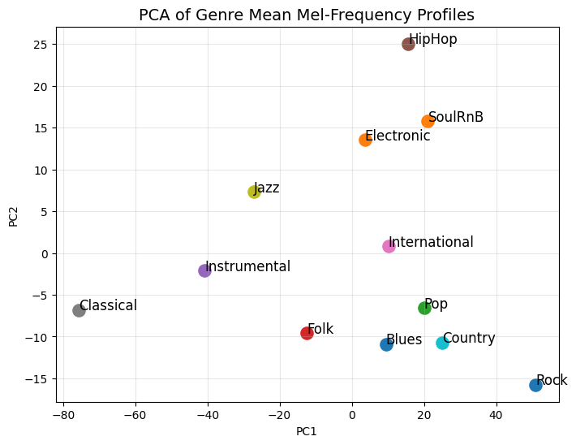

## 3. Central Method: Architecture & Training Framework

Our work builds on the convolutional architectures introduced in Choi et al. (2017) for music tagging on the Million Song Dataset with Last.fm tags.
In their study, the authors trained several CNN and CRNN variants on log-Mel spectrograms to predict the top-50 most frequent multi-label tags (including genres, moods, instruments, and eras).

Among the paper’s models (k1c2, k2c1, k2c2, and CRNN) the k2c2 CNN (stacked 3×3 convolutions with asymmetric pooling) was the strongest pure-convolutional baseline and serves as the foundation of our study.
While the original paper evaluates models exclusively using AUC-ROC, we broaden the evaluation for our multi-label top-genre classification task on FMA by also reporting mAP, F1 scores, ranking loss, Recall@3, and per-class AP, resulting in a more complete picture of classifier behavior across imbalanced genres.

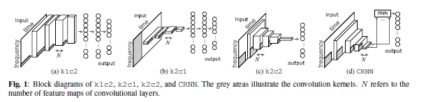

  
Architectures, Training Mechanisms & Regularization

### Architectures Used in Our Study

All models in our work are 2D CNNs applied directly to 128×3000 Mel-spectrograms.
Depending on the variant, they differ in:

- time-frequency structure (k1c2, k2c1, k2c2)

- kernel size (3×3, 5×5, 7×7)

- network capacity (number of channels per block)

Across all variants, we keep the core architectural principles consistent to enable fair comparison:

- Fully convolutional design (no dense layers)

- Five convolutional blocks (four in k1c2)

- ELU activations in all layers

- Asymmetric max-pooling, reducing time more aggressively than frequency (as in Choi et al.)

- Global average pooling followed by a 1×1 classification head

--> ensures that performance differences arise from architectural factors of interest (e.g., kernel sizes or capacity), rather than unrelated design changes.

### Training Mechanisms

All models are trained using a unified, modern setup:

- Optimizer: AdamW

- Learning rate schedule: One-Cycle policy

- Weight decay: 1e-4

- Dropout: 0.2 in all convolutional blocks

- Activation: ELU

- Batch size: 32

- Epochs: 20 for every experiment

- Task: multi-label classification over 12 top-level FMA genres

--> this setup promotes fast convergence, stable optimization, and fair comparison across all architectural variants.

### Regularization

The original paper provides limited detail on regularization and used only minimal dropout (for CRNN).
When reproducing the paper k2c2 architecture on the FMA dataset, however, we observed significant overfitting without additional stabilization.
To create a robust and fair baseline, we introduced:

- Dropout inside convolutional blocks

- Weight decay with AdamW

- A tuned One-Cycle learning-rate schedule

These additions are not part of the scientific experiment—they establish a consistent and reliable training regime so that architectural differences (especially kernel size changes) can be evaluated meaningfully.

## 4. Key experiments & results

### Baseline Reproduction

We reimplemented the paper k2c2 architecture from Choi et al. (2017) and trained it on our FMA top-genre dataset using regularization (dropout + weight decay).
--> fair and stable reference point for all subsequent comparisons.

We additionally included the original paper’s structural alternatives:

- k1c2 - temporal-only convolution (1×4 kernels)

- k2c1 - full-frequency first layer, then temporal convolutions

--> contrastive baselines that break time–frequency locality.

### Increased Model Capacity

To test whether performance is limited by undercapacity rather than kernel design, we created an improved k2c2 model:

- identical architecture structure

- wider channel configuration (32, 64, 128, 256, 512)

--> isolates the effect of capacity scaling while keeping kernel sizes fixed at 3×3.

### Kernel-Size Experiments

We designed three systematic variants:

- k2c2-k5-all - all convolution kernels increased from 3×3 to 5×5

- k2c2-k5-early - only the first two blocks use 5×5 kernels

- k2c2-k7-all - very large first-layer kernels (7×7) to test broad receptive fields

This experiment examines whether:

- larger kernels capture more global musical context

- early vs. late kernel enlargement matters

- very large receptive fields blur time–frequency structure

### Model Overview

| Model Name                                   | Blocks | Channels                       | Kernel Sizes per Block                      | Pooling per Block                           | Notes / Purpose |
|----------------------------------------------|--------|--------------------------------|---------------------------------------------|------------------------------------------------|-----------------|
|  paper k2c2                                  | 5      | [64, 128, 128, 256, 256]       | [3×3, 3×3, 3×3, 3×3, 3×3]                   | (2×4),(2×4),(2×4),(3×5),(4×4)                | Exact architecture from Choi et al. (2017). Baseline. |
| paper k2c2 regularized + finetuned           | 5      | [64, 128, 128, 256, 256]       | [3×3 × 5]                                    | (2×4),(2×4),(2×4),(3×5),(4×4)                | Baseline with dropout + tuned hyperparameters. |
| improved k2c2-k3-all| 5      | [32, 64, 128, 256, 512]        | [3×3 × 5]                                    | (2×4),(2×4),(2×4),(3×5),(4×4)                | Wider channel pyramid (more capacity). |
| improved k2c2-k5-all                                  | 5      | [32, 64, 128, 256, 512]        | [5×5, 5×5, 5×5, 5×5, 5×5]                    | (2×4),(2×4),(2×4),(3×5),(4×4)                | Tests effect of larger receptive fields. |
| improved k2c2-k5-early                                | 5      | [32, 64, 128, 256, 512]        | [5×5, 5×5, 3×3, 3×3, 3×3]                    | (2×4),(2×4),(2×4),(3×5),(4×4)                | Tests early large kernels vs. later small ones. |
| improved k2c2-k7-early                                  | 5      | [32, 64, 128, 256, 512]        | [7×7, 3×3, 3×3, 3×3, 3×3]                    | (2×4),(2×4),(2×4),(3×5),(4×4)                | Tests very large first-layer receptive field. |
| k1c2                  | 4      | [32, 64, 128, 256]             | [1×4, 1×4, 1×4, 1×4]                          | (1×4),(1×5),(1×8),(1×8)                      | Temporal-only model. |
| k2c1                  | 5      | [32, 64, 128, 256, 256]        | [128×1, 1×4, 1×4, 1×4, 1×4]                   | (1×4),(1×4),(1×5),(1×5),(1×5)                | Full-frequency first layer; loses TF locality. |

### Results

| Model                                   | mAP    | F1 Macro | F1 Micro | Ranking Loss | Recall@3 | Loss Train | Loss Val | AUC Macro | AUC Micro |
|-----------------------------------------|--------|----------|----------|--------------|-----------|------------|----------|-----------|-----------|
| **paper k2c2**                           | 0.5066 | 0.4657   | 0.5955   | 0.1018       | 0.8098    | 0.0460     | 0.2930   | 0.8538    | 0.9015    |
| **paper k2c2 regularized + finetuned**  | 0.5274 | 0.4350   | 0.6095   | 0.0843       | 0.8393    | 0.1931     | 0.2102   | 0.8757    | 0.9195    |
| **improved k2c2-k3-all**              | 0.5336 | 0.4430   | 0.6067   | 0.0838       | 0.8411    | 0.1901     | 0.2105   | 0.8766    | 0.9197    |
| **improved k2c2-k5-all**                          | **0.5461** | **0.4570** | **0.6148** | **0.0825** | **0.8437** | **0.1820** | **0.2090** | **0.8800** | **0.9216** |
| **improved k2c2-k5-early**                        | 0.5314 | 0.4409   | 0.6090   | 0.0834       | 0.8400    | 0.1906     | 0.2099   | 0.8777    | 0.9200    |
| **improved k2c2-k7-early**                          | 0.5327 | 0.4426   | 0.6100   | 0.0839       | 0.8403    | 0.1905     | 0.2101   | 0.8769    | 0.9199    |
| **k1c2**         | 0.4121 | 0.2636   | 0.5242   | 0.1055       | 0.8022    | 0.2391     | 0.2353   | 0.8310    | 0.8943    |
| **k2c1**         | 0.4554 | 0.3394   | 0.5673   | 0.0960       | 0.8202    | 0.2270     | 0.2237   | 0.8501    | 0.9061    |

  
Interpretation of Results

### Interpretation of Results

##### 1. Better training > architectural tweaks

Updating the paper’s training setup (AdamW, One-Cycle LR, dropout, weight decay) noticeably improved the original k2c2 baseline.

--> adapted training alone gives a strong boost, even before changing any architecture.

##### 2. Wider channels: faster convergence, but only small accuracy gains

We increased the channel widths from the paper’s
[64, 128, 128, 256, 256] → [32, 64, 128, 256, 512].

- Training became faster and more stable

- Performance improved only slightly (mAP + ~0.006)

--> More capacity helps a bit, but not nearly as much as training improvements or kernel size changes.

##### 3. Kernel size is the strongest architectural factor

All kernel experiments were derived from the same improved model.
Clear winner: 5×5 kernels everywhere (k5-all).

- Best mAP, best F1, best AUC, lowest ranking loss

- Most consistent improvement across all metrics

--> Moderately larger kernels (5×5) help the model capture broader time–frequency patterns without losing local detail.

Early-only enlargement (k5-early, k7-early) also helped, but not as much:

--> Receptive field should grow across all layers, not just the first.

##### 4. Models that break time–frequency locality perform worse

k1c2 (temporal-only):

- convolves only over time, not frequency.

- Performs the worst (mAP 0.4121).

--> Ignoring frequency structure seems to make the model blind to most musical cues.

k2c1 (full-frequency first layer):

- First layer collapses the entire 128-bin frequency axis.

- Destroys local spectral patterns (e.g., brightness, harmonic richness) before deeper layers can learn them.

- Much weaker performance (mAP 0.4554).

--> Over-compressing frequency information early leads to irreversible information loss.

  
Model Diagnostics

### Model Diagnostics (for improved k2c2-k5-all)

#### Performance Metrics

##### Train/Val Loss

- Both curves decrease steadily, meaning the model is learning meaningful structure rather than memorizing noise.
- Validation loss stays close to training loss, indicating little to no overfitting 

##### mAP
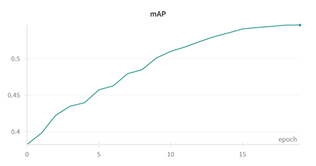

- Measures how well the model ranks correct genres above incorrect ones across all labels.
- Threshold-independent: evaluates the quality of confidence ordering, not binary predictions.
- A value around 0.54 means the model ranks the true genres above non-relevant genres fairly reliably (strong performance given the difficulty of multi-label music tagging and the imbalance across genres)

##### F1 (Micro/Macro)
 

- F1 Macro: averages F1 per class --> treats all genres equally, regardless of how many samples they have
- F1 Micro: aggregates all predictions globally --> dominated by the frequent genres.
- Both scores improve steadily, showing the model is learning consistent decision boundaries.
- F1 Micro (~0.61) is much higher than F1 Macro (~0.46) --> the model performs better on common genres than on rare ones (expected for imbalanced data).
- Macro F1 rising throughout training indicates the model slowly learns to recognize minority genres as well, not just the dominant ones.

##### Ranking Loss / Recall@3
 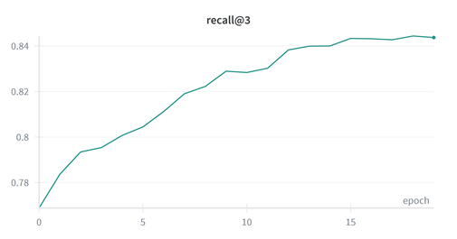

- Ranking Loss: fraction of times a true label gets ranked below a false label (Lower is better. Perfect ranking = 0)
- Recall@3: how often at least one of the top-3 predicted genres is correct (Higher is better)
- Ranking Loss drops from ~0.12 → ~0.085, showing the model increasingly places true genres above false ones.
- Recall@3 rises to ~0.84, meaning the model suggests a correct genre in its top-3 predictions in 84% of tracks.
- Together, they indicate that the model is effective at ranking genres, not just producing good absolute probabilities.

#### Confusion Co-occurence Matrix

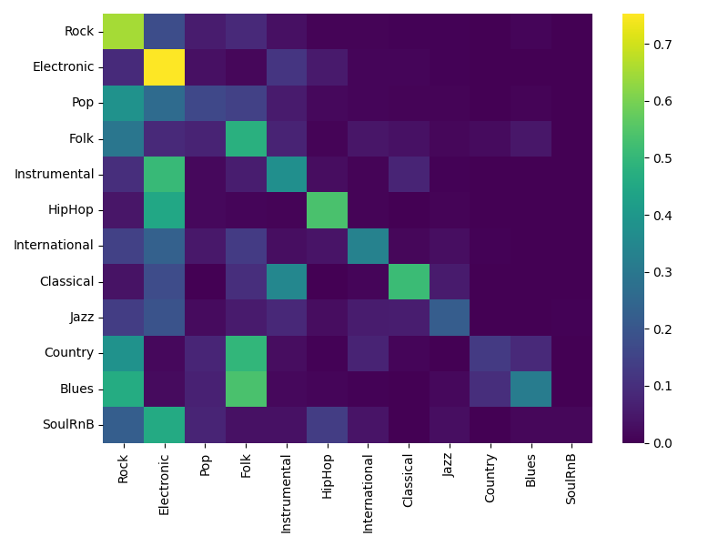

Interpretation:
- Rows = true genres
- Columns = predicted genres
- Matrix entry M[i, j] = P(predicted genre j | true genre i)

##### 1. Rock: often predicted together with Pop, Country, and Blues
- pssoible reason: categories share similar overall sound characteristics (e.g., guitars, drums), so the model groups them
- Rock is not co-predicted with Electronic (second most frequent label): showing the model can separate “band-like” and “synthetic” sound profiles.

##### 2. Electronic: high recall, occasionally co-predicted with HipHop and Instrumental
- sometimes predicted together with HipHop or Instrumental, maybe due to similar shared digital sound qualities.
- Electronic is one of the most confidently identified genres.

##### 3. Pop: weak diagonal and low co-prediction
- Pop is rarely predicted when other genres are present, and its correct-prediction rate is relatively low.
- model has trouble finding a consistent pattern that defines it.

##### 4. HipHop: clearest pattern with minimal co-predictions
- With the exception of some overlap with Electronic, the model rarely predicts additional genres when HipHop is present.
- HipHop appears highly distinctive to the model.

##### 5. Small genres (Jazz, Country, Blues, SoulRnB): low prediction rates overall
- The model is cautious about predicting them, likely due to limited data and higher variability.

#### Selected Per-Genre Confusion Matrices
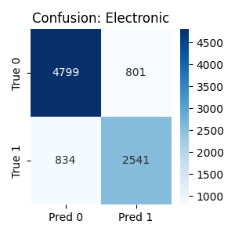 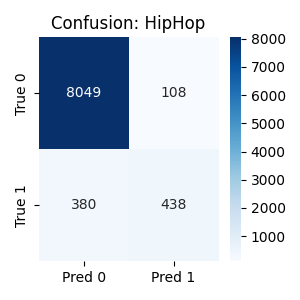 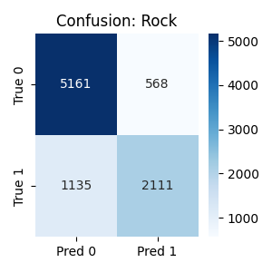 

##### Rock

- has more false negatives than false positives (model under-predicts)
- model seems conservative with Rock, requiring strong evidence to activate the label
- appears frequently in columns of Pop, Blues, Country in co-occurence matrix (consistent with the FP count)

##### Electronic

- Electronic has more balanced FP/FN rates than Rock.
- predicted relatively often for non-Electronic tracks (FP = 801), consistent with the co-occurrence matrix where Electronic appears strongly in rows of HipHop and Instrumental

##### HipHop

- HipHop has a very low false-positive rate --> the model almost never predicts HipHop unless it is actually present, but FN is relatively high --> the model often misses HipHop.
- aligns with the co-occurrence heatmap where HipHop has one of the cleanest columns, meaning it is rarely confused with other genres.

##### SoulRnB

- Extremely few predictions overall (the model almost never predicts SoulRnB)
- FP is basically zero 
- TP is extremely small --> the model fails to detect SoulRnB almost always (due to very low training frequency)

#### Interpretation of Grad-CAM Evolution Across Training

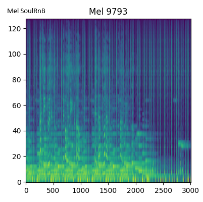 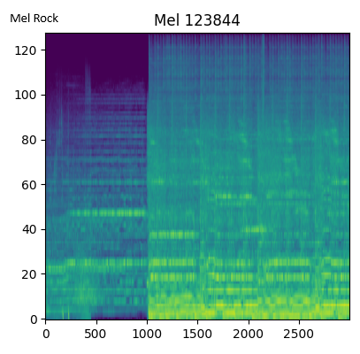  

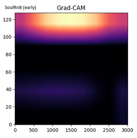  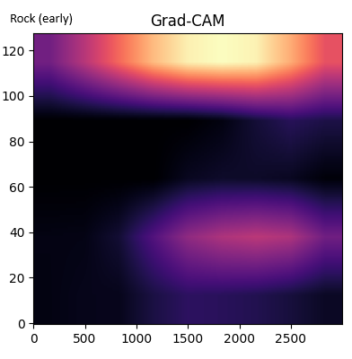 

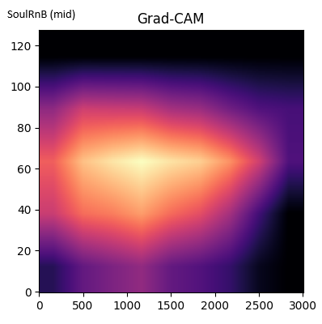  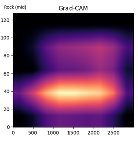 

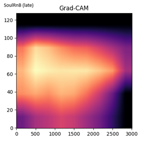  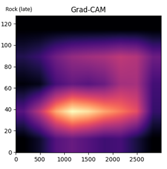 

##### 1. Early Epochs

- Activations are broad, blurry, and similar across all three genres.

- Strong emphasis on the upper Mel bins (high frequencies).

- The model has not yet learned genre-specific structure.

##### 2. Mid Epochs 

- Activations become more focused and more distinct between genres:

- SoulRnB: higher and smoother spectral emphasis

- Rock: lower-mid focus

- HipHop: wide-band, more evenly distributed activation

- The model begins to pick up genre-relevant spectral structure

##### 3. Late Epochs 

- Each genre exhibits a distinct and repeatable pattern:

- SoulRnB: Broad activation across mid-to-high frequencies (≈60–90 Mel bins), covering a wider range rather than a single smooth band

- Rock: Clear, sharp focus in the 30–40 Mel bin region with little activity above ≈80 bins.

- HipHop: A wide spread across mid and upper-mid frequencies, forming the broadest activation footprint of the three.

- The model has converged on genre-specific filters.

## 5. Discussion

### Main observations

#### 1. Kernel size is the most influential architectural factor.
Enlarging convolution kernels to 5×5 across all layers (k2c2-k5-all) consistently improved every metric. These kernels capture a better mix of local detail and broader time–frequency context. Early-only large kernels or very large first-layer kernels helped less, suggesting that receptive field growth across the entire network is more important than front-loading it.

#### 2. Time–frequency locality matters.
Models such as k1c2 and k2c1, which either restrict or collapse the frequency dimension too early, perform significantly worse. Genre-relevant cues live in local frequency patterns, and once these are lost, deeper layers cannot recover them.

#### 3. Training improvements had greater impact than architectural changes.
Updating the training pipeline (AdamW, weight decay, dropout, One-Cycle learning rate) produced a substantial performance gain. This indicates that much of the improvement over the original paper comes from modern optimization rather than altering the core architecture.

### Limitations

#### 1. Rare genres remain difficult to detect.
Macro-F1 remains well below micro-F1, and confusion analyses show weak recall for classes with few examples. The model behaves conservatively and tends to avoid assigning rare genres.

#### 2. Broad or weakly defined genres (e.g., Pop) are inconsistent.
Pop has a weak diagonal in the co-occurrence matrix, indicating that the model struggles to identify a consistent spectral signature for it.

#### 3. Grad-CAM activations remain relatively coarse.
Although attention stabilizes across epochs, the model focuses on broad frequency regions rather than detailed temporal–spectral patterns.

### Potential improvements

#### 1. Handling label imbalance.
Loss functions such as focal loss or class-balanced loss, or sample-level balancing strategies, could help improve recall for minority genres.

#### 2. Shorter audio windows / smaller spectrograms.
Using 5–10 second excerpts instead of full 30-second clips would reduce storage and memory footprint and speed up training

#### 3. Using architectures with longer temporal modeling.
CRNNs, temporal attention, or transformer-based models could capture longer-range structure that pure CNNs struggle with.